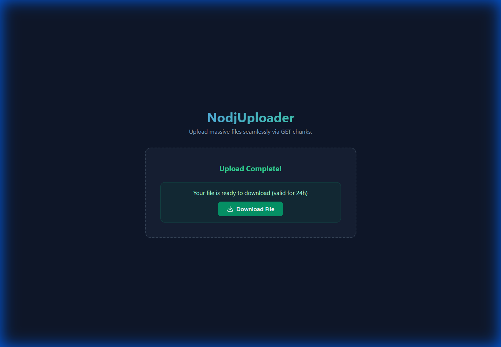
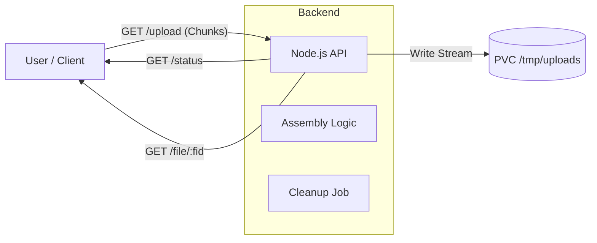

# Nodejuploader

**Nodejuploader** is a modern, high-performance file upload service designed to handle massive files (multiple GBs) using exclusively **HTTP GET requests** and chunking. It eliminates the need for `POST` requests or `multipart/form-data`, offering a unique approach to large file transfer with pause/resume capabilities (in design) and strict integrity checks.



## 🚀 Features


-   **Zero POST**: All data is transferred via GET query parameters.
-   **Chunked Uploads**: Files are split into 1KB chunks (configurable) to avoid timeout and memory issues.
-   **Integrity Guaranteed**: SHA-256 hash verification for every file.
-   **Ephemeral Storage**: Automatic cleanup of files after 24 hours.
-   **Cloud Native**: Designed for Kubernetes with stateless API nodes and shared storage (PVC).

## ARCHITECTURE



## 🛠️ Tech Stack

-   **Frontend**: React, Vite, TailwindCSS, Lucide Icons.
-   **Backend**: Node.js, Express, fs-extra, node-cron.
-   **Protocol**: Custom GET-based chunking protocol.

## 📦 Installation

### Prerequisites
-   Node.js >= 20
-   npm >= 10

### Setup

1.  **Clone the repository**
    ```bash
    git clone https://github.com/yourusername/nodejuploader.git
    cd nodejuploader
    ```

2.  **Install Backend Dependencies**
    ```bash
    cd back
    npm install
    ```

3.  **Install Frontend Dependencies**
    ```bash
    cd ../front
    npm install
    ```

## 🏃‍♂️ Usage

### Running Locally

1.  **Start the Backend** (Port 8080)
    ```bash
    cd back
    npm start
    ```

2.  **Start the Frontend** (Port 5173)
    ```bash
    cd front
    npm run dev
    ```

3.  Open `http://localhost:5173` in your browser.

## 🧪 Testing

### Backend
```bash
cd back
npm test
```

### Frontend
```bash
cd front
npm test
```

## 🐳 Docker

### Build the Image

```bash
cd back
docker build -t nodejuploader:latest .
```

### Run with Docker

```bash
docker run -p 8080:8080 -v uploads:/tmp/uploads nodejuploader:latest
```

## ☸️ Kubernetes Deployment

All Kubernetes manifests are located in the `k8s/` directory.

### Quick Deploy

```bash
# Create namespace
kubectl apply -f k8s/namespace.yaml

# Create persistent volume claim
kubectl apply -f k8s/pvc.yaml

# Deploy the application
kubectl apply -f k8s/deployment.yaml
kubectl apply -f k8s/service.yaml
kubectl apply -f k8s/ingress.yaml

# (Optional) Enable autoscaling
kubectl apply -f k8s/hpa.yaml

# (Optional) Enable automatic cleanup
kubectl apply -f k8s/cronjob.yaml
```

### Configuration

| File | Description |
|------|-------------|
| `namespace.yaml` | Creates `nodejuploader` namespace |
| `pvc.yaml` | 20Gi persistent volume for uploads (RWX) |
| `deployment.yaml` | 2-replica deployment with health checks |
| `service.yaml` | ClusterIP service on port 80 |
| `ingress.yaml` | Nginx ingress (configure your domain) |
| `hpa.yaml` | Autoscaler (2-10 replicas, 70% CPU) |
| `cronjob.yaml` | Hourly cleanup of expired files |

### Important Notes

- **PVC requires ReadWriteMany** access mode for multi-pod deployments
- Update `ingress.yaml` with your actual domain
- Set appropriate `storageClassName` in `pvc.yaml` for your cluster

## 📄 License
MIT
